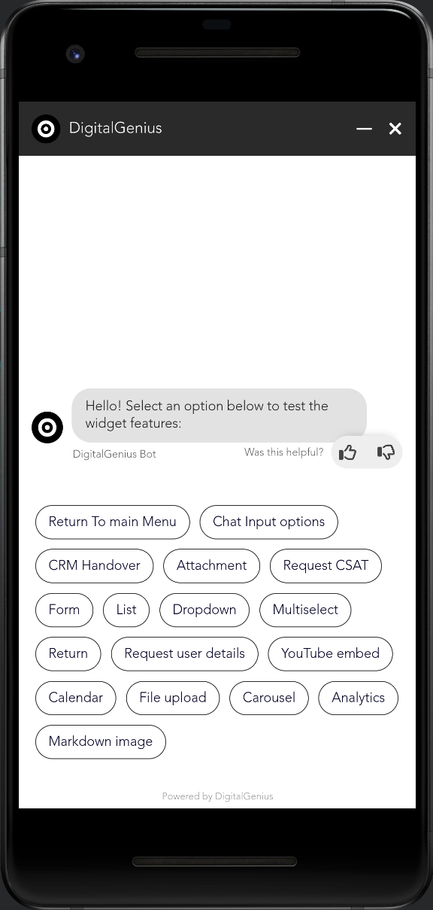
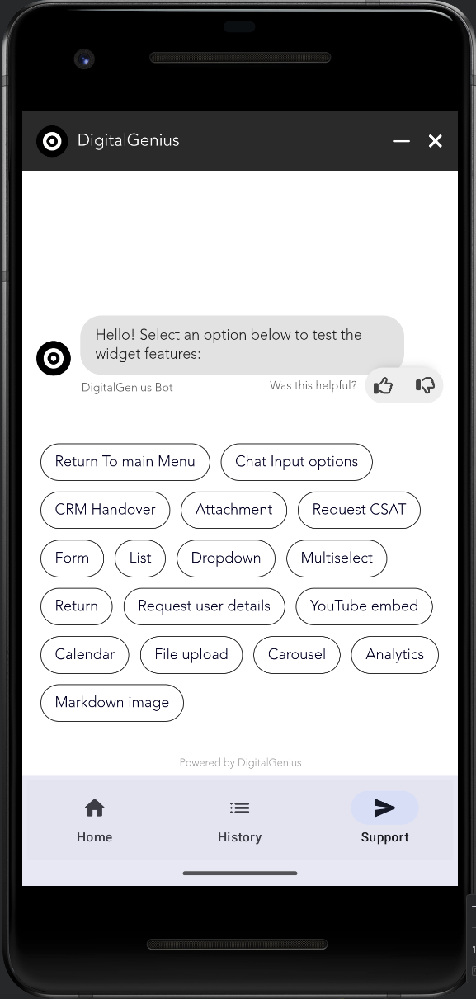

# Module chatwidgetsdk

# ``DGChatSDK``

Android SDK for DigitalGenius Chat.

## Overview
This SDK enables the DigitalGenius Chat Widget to be embedded anywhere inside an Android app.
The SDK requires minimal setup.

A DigitalGenius Customer Success Manager will provide you with a custom `widgetId`, `env` and `version` before getting started.
Please see the `Integrating SDK to your project` section for details on how to integrate the following settings into an Android app using the SDK.

## Installation

1. Extract the provided `chatwidgetsdk` zip.
2. Add to your build gradle file:
    ```Groovy
    dependencies {
        implementation fileTree(include: ['*.jar', '*.aar'], dir: 'libs')
    }
    ```
3. Put `DGChatSDK.aar` into your `project/module/libs` folder.
4. Click `Sync Project with Gradle files` in Android Studio

## Basic usage example

```Kotlin
class MainActivity : ComponentActivity() {
    override fun onCreate(savedInstanceState: Bundle?) {
        super.onCreate(savedInstanceState)
        DGChatSdk.init(
            widgetId = "your_widget_id",
            env = "your_env",
            version = "your_version",
            useCache = true,
            crmPlatform = "your_crm", // optional
            crmVersion = "your_crm_version", // optional
            callbacks = object : IDGChatWidgetListener {
                override fun onChatMinimizeClick() {
                    Toast.makeText(
                        this@MainActivity,
                        "User callback -> onChatMinimizeClick",
                        Toast.LENGTH_LONG
                    ).show()
                }

                override fun onChatEndClick() {
                    Toast.makeText(
                        this@MainActivity,
                        "User callback -> onChatEndClick",
                        Toast.LENGTH_LONG
                    ).show()
                }

                override fun onChatLauncherClick() {
                    Toast.makeText(
                        this@MainActivity,
                        "User callback -> onChatLauncherClick",
                        Toast.LENGTH_LONG
                    ).show()
                }

                override fun onChatProactiveButtonClick() {
                    Toast.makeText(
                        this@MainActivity,
                        "User callback -> onChatProactiveButtonClick",
                        Toast.LENGTH_LONG
                    ).show()
                }

                override fun onCSATPopoverCloseClicked() {
                    Toast.makeText(
                        this@MainActivity,
                        "User callback -> onCSATPopoverCloseClicked",
                        Toast.LENGTH_LONG
                    ).show()
                }
            },
            metadata = """
                metadata: {
                    "currentPage": "some-random-string",
                    "currentPageTitle": "another-random-string"
                }
            """.trimIndent()
        )
        attachDGChatViewToLifecycle()

        /*
            ....
         */

       val methods = showDGChatView()
       methods.minimizeWidget()
       methods.sendMessage("your message")
       methods.launchWidget()
       methods.initProactiveButtons(
          listOf("question1", "question2", "question3"),
          listOf("answer1", "answer2", "answer3")
       )
    }
}
```
⚠️ It is highly important to provide ``version`` as a [Semantic versioning three-part version number](https://en.wikipedia.org/wiki/Software_versioning). Otherwise, you'll encounter runtime error.
And finally, just call ``showDGChatViewWith(animator: DGChatViewAnimator)`` to present a chat button on top of specified Activity with animation or ``showDGChatView()`` without.

Methods ``showDGChatViewWith(animator: DGChatViewAnimator)`` and ``showDGChatView()`` returned ``DGChatMethods`` which can be used to performed programmatically widget actions

Best user experience with DGChatSDK achieved when using maximum possible view size e.g. - full size View or Window itself.

## Sample project

The interaction model and example usage can be found in Demo project. Refer to the `MainActivity.kt` file.


# React-native

## Installation

1. Extract the provided `chatwidgetsdk` zip.
2. Add to your build gradle file:
    ```Groovy
    dependencies {
        implementation fileTree(include: ['*.jar', '*.aar'], dir: 'libs')
        implementation(platform("org.jetbrains.kotlin:kotlin-bom:1.8.0"))
        implementation("androidx.compose.runtime:runtime:1.4.3")
    }
    ```
3. Put `DGChatSDK.aar` into your `project/android/app/libs` folder.
4. Click `Sync Project with Gradle files` in Android Studio

## Basic usage example
Add to your react-native application class:

```Java
public class MainApplication extends Application implements ReactApplication {
        ...
        @Override
        protected List<ReactPackage> getPackages() {
          @SuppressWarnings("UnnecessaryLocalVariable")
          List<ReactPackage> packages = new PackageList(this).getPackages();
          // Packages that cannot be autolinked yet can be added manually here, for example:
           packages.add(new DGChatSdkPackage());
          return packages;
        }
         ...
```

Add to your react-native activity class:
```Java
    @Override
    protected void onCreate(Bundle savedInstanceState) {
        super.onCreate(savedInstanceState);
        DGChatSdkModule.Companion.initDgChatSdkModule(this);
    }
```

Add to your react-native App.tsx:
```JavaScript
import {useEffect, useState} from 'react';
import {NativeEventEmitter, NativeModules} from 'react-native';
const {DGChatModule} = NativeModules;

...
useEffect(() => {
    const eventEmitter = new NativeEventEmitter(NativeModules.DGChatModule);
    let onChatMinimizeClickEventListener = eventEmitter.addListener('OnChatMinimizeClick', event => {
      DGChatModule.showToast("OnChatMinimizeClick")
    });
    let onChatEndClickEventListener = eventEmitter.addListener('onChatEndClick', event => {
      DGChatModule.showToast("onChatEndClick")
    });
    let onChatLauncherClickEventListener = eventEmitter.addListener('onChatLauncherClick', event => {
      DGChatModule.showToast("onChatLauncherClick")
    });
    let onChatProactiveButtonClickEventListener = eventEmitter.addListener('onChatProactiveButtonClick', event => {
      DGChatModule.showToast("onChatProactiveButtonClick")
    });
    let onCSATPopoverCloseClickedEventListener = eventEmitter.addListener('onCSATPopoverCloseClicked', event => {
      DGChatModule.showToast("onCSATPopoverCloseClicked")
    });


    return () => {
      onChatMinimizeClickEventListener.remove(); 
	  onChatEndClickEventListener.remove(); 
	  onChatLauncherClickEventListener.remove(); 
	  onChatProactiveButtonClickEventListener.remove();
	  onCSATPopoverCloseClickedEventListener.remove();
    };
  }, []
);
...
    DGChatModule.showDGChatView(
       "your_widget_id",
       "your_env",
       "your_version",
       true, 
       crmPlatform, // optional
       crmVersion, // optional
       "metadata: { \"currentPage\": \"some-random-string\", \"currentPageTitle\": \"another-random-string\"}"
    );
...

       DGChatModule.sendMessage("your message")
       DGChatModule.launchWidget()
       DGChatModule.initProactiveButtons(
          ["question1", "question2", "question3"],
          ["answer1", "answer2", "answer3"]
       )
...
```
## Full screen support
There are two ways to display your Genius chat with full screens:
1. Custom your activity styles:
     ```xml
    <resources>
       <style name="Theme.MyApplication" parent="android:Theme.Material.Light.NoActionBar">
           <item name="android:windowFullscreen">true</item>
       </style>
    </resources>
    ```
2. Set full screen programmatically:

    ```Kotlin
    window.setFlags(
       WindowManager.LayoutParams.FLAG_LAYOUT_NO_LIMITS,
       WindowManager.LayoutParams.FLAG_LAYOUT_NO_LIMITS
    )
   ```
   Then hide status bar:

    ```Kotlin
    WindowCompat.getInsetsController(window, window.decorView).apply {
        hide(WindowInsetsCompat.Type.systemBars())
    }
    ```

Screenshot:



Full screen with bottom navigation tabs:
1. Enable draw over system bar in your activity:
   ```Kotlin
    enableEdgeToEdge()
    ```

2. Hide status bar when Genius Chat tab is shown:

   ```Kotlin
   WindowCompat.getInsetsController(activity.window, activity.window.decorView).apply {
        if (selectedItem == 2) {
            hide(WindowInsetsCompat.Type.statusBars())
        } else {
            show(WindowInsetsCompat.Type.statusBars())
        }
   }
   ```

Screenshot:



## Sample project
The interaction model and example usage can be found in Demo project.
